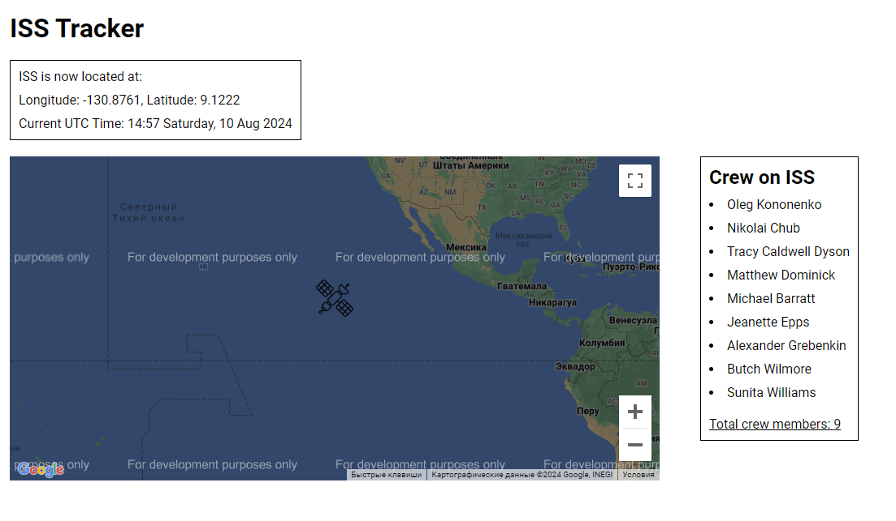

# ISS Tracker

## Description

ISS Tracker is a web application that provides real-time tracking of the International Space Station (ISS) and its crew. The application displays the current location of the ISS on a map, shows details about the crew aboard, and updates every 5 seconds.

## Screenshots



## Features

- **Real-time ISS Location**: Displays the current latitude and longitude of the ISS using the OpenNotify API.
- **Crew Information**: Shows the current crew members aboard the ISS.
- **Automatic Updates**: Refreshes the location and crew data every 5 seconds.
- **Current UTC Time**: Displays the current time in UTC in a human-readable format.


## Installation and Setup

1. Clone the repository:
    ```bash
    git clone https://github.com/yourusername/iss-tracker.git
    ```

2. Navigate to the project directory:

    ```bash
    cd iss-tracker
    ```

3. Install dependencies:

    ```bash
    npm install
    ```


4. Start the application:

    ```bash
    npm start
    ```

    Open your browser and navigate to [http://localhost:3000](http://localhost:3000) to see the application in action.

## Technologies Used

- **React**: JavaScript library for building user interfaces.
- **Google Maps JavaScript API**: For displaying the map and marker.
- **OpenNotify API**: For retrieving ISS location and crew data.
- **CSS**: For styling components.

## Contributing

If you would like to contribute to this project, please create a pull request. Make sure to follow the code style and contribution guidelines specified in the project.

## Contact

For questions or suggestions, you can contact me via [yuraplatonov2000@gmail.com](yuraplatonov2000@gmail.com) or open an issue in the repository.
